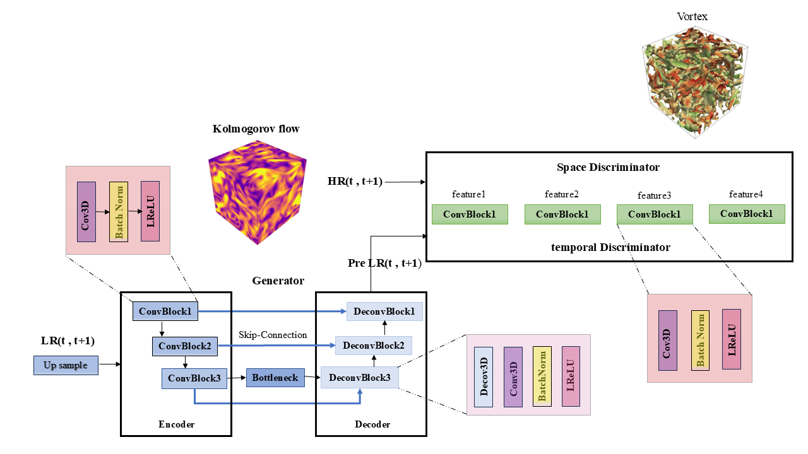
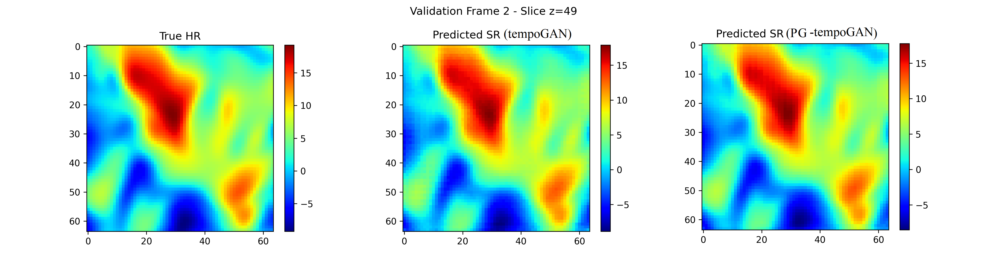
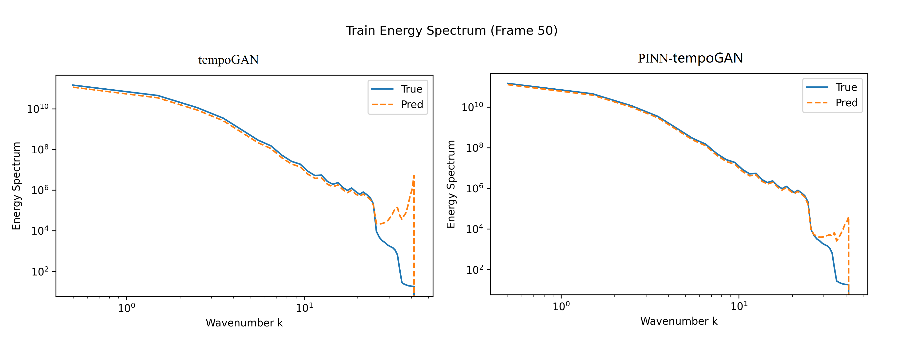
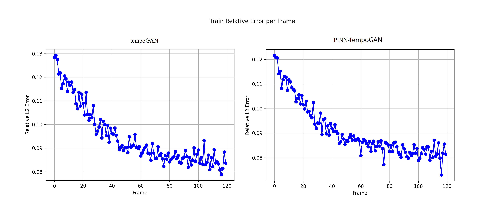

# Physics-Guided TempoGAN for Turbulence Super-Resolution

This repository presents a physics-guided TempoGAN framework for 3D turbulence super-resolution of freely decaying homogeneous isotropic turbulence.
The proposed model improves the recovery of fine-scale turbulent structures and temporal coherence, while incorporating divergence and spectral constraints to enhance physical consistency and mitigate nonphysical spectral artifacts.


# Overview

Turbulence super-resolution using generative adversarial networks (GANs) has shown strong capability in reconstructing high-resolution flow fields from coarse inputs.However, most existing studies primarily evaluate performance through visual similarity or directional energy spectra, which may overlook deeper physical inconsistencies.In this work, we show that GAN-based turbulence reconstruction can exhibit **anisotropic spectral distortion**, where directional spectra appear accurate, while the full three-dimensional energy distribution reveals nonphysical energy redistribution at high wavenumbers.To address this issue, we propose a **physics-guided TempoGAN (PGTempoGAN)** framework that incorporates divergence, vorticity, and spectral constraints into the training process.  These constraints improve the reconstruction of fine-scale turbulent structures and enhance the physical consistency of the generated flow fields.


## 🚀 Key Contributions

- 🔹 Identified **anisotropic spectral distortion** in GAN-based turbulence super-resolution  
- 🔹 Showed that **directional spectral agreement can mask true energy imbalance**
- 🔹 Introduced **physics-informed losses**:
  - divergence-free constraint
  - spectral energy constraint
- 🔹 Improved reconstruction of **small-scale turbulent structures**
- 🔹 Provided comprehensive evaluation:
  - 1D / 3D / 2D spectra
  - PDFs
  - SGS stresses
  - two-point correlations

---

## 🔬 Key Insight

Directional agreement does not imply physical consistency.

Even when spectra along coordinate directions match DNS well,  
the full 3D energy distribution may reveal:

👉 **anisotropic energy amplification at high wavenumbers**

This highlights a fundamental limitation of standard CNN-based GAN models:

> ❗ **Directional consistency ≠ isotropic spectral fidelity**

## Directories
Main source code directories:

`.../main/train:` Training script

`.../main/test:`  Inference and evaluation

`.../main/tempoGAN:`  Generator and discriminators definition

`.../main/losses:`  GAN, feature matching, and physics-based losses

`.../data/dns_preprocess:`  DNS data preprocessing pipeline

`.../main/utils:`  Helper functions (normalization, visualization, etc.)

# Data Preparation

The dataset used in this work is derived from a **3D homogeneous isotropic turbulence (HIT) dataset** provided by **RWTH Aachen University**.  
It consists of **Direct Numerical Simulation (DNS)** snapshots capturing **velocity fields (U, V, W)** at multiple time steps for freely decaying isotropic turbulence.  
These high-fidelity DNS fields serve as ground truth for both spatial and temporal super-resolution training.

Detailed dataset information, including generation methodology and access instructions, can be found at  
➡️ [**HIT Turbulence Dataset – RWTH Aachen**](https://ryleymcconkey.com/2025/08/HIT-turbulence-dataset/)

Before training, preprocess the raw DNS data using the provided data preparation script to generate normalized low- and high-resolution pairs suitable for model input.


# Training
python train_tempoGAN.py


# Testing & Visualization
python test_tempoGAN.py


## ⚙️ Method
We extend the original TempoGAN by introducing physics-guided constraints:

- Divergence loss → enforce incompressibility  
- Spectral loss → regularize energy distribution  

These constraints guide the model toward physically consistent solutions while preserving temporal coherence.

<div align="center">
  
</div>

---

## 📊 Results

### Flow Reconstruction

Both TempoGAN and PGTempoGAN achieve visually similar results:

<div align="center">
  
</div>

---

### Spectral Analysis

PGTempoGAN significantly improves high-wavenumber behavior:

<div align="center">
  
</div>

---

### Error Evaluation

The incorporation of physics-guided constraints results in a lower single-frame NRMSE, reflecting improved reconstruction accuracy:

<div align="center">
  
</div>

---

### Additional Analysis

We further evaluate:

- Probability density functions (PDFs)
- Subgrid-scale (SGS) stresses
- Two-point correlations

These results confirm improved **statistical consistency** of reconstructed turbulence.

# Citation

If you find this work useful, please consider citing the corresponding paper:

```
@article{Wang2025PINN-tempoGAN,
    title={Physics-guided TempoGAN for turbulence super-resolution: mitigating
anisotropic spectral distortion},
    author={YUJIE WANG,ZHISONG WANG},
    year={2025}
}
